# AssignMe — Full Pipeline Architecture
### Stakeholder Presentation Reference

> All numbers, thresholds, and logic below are derived directly from the production codebase.

---

## 1. End-to-End Pipeline Overview

```mermaid
flowchart TD
    classDef stage fill:#f9f0ff,stroke:#d6bcfa,stroke-width:2px,color:#444
    classDef logic fill:#ebf8ff,stroke:#90cdf4,stroke-width:2px,color:#444
    classDef db fill:#f1f5f9,stroke:#cbd5e1,stroke-width:2px,color:#444
    classDef engine fill:#e6fffa,stroke:#81e6d9,stroke-width:2px,color:#444
    classDef llm fill:#fefce8,stroke:#fde68a,stroke-width:2px,color:#444
    classDef enrichment fill:#fff7ed,stroke:#fed7aa,stroke-width:2px,color:#444
    classDef danger fill:#fff5f5,stroke:#fc8181,stroke-width:2px,color:#444

    A[Cron / Manual Run] --> B[Stage 1: watcher.py]:::stage
    B --> B1[Apify: Fetch LinkedIn QA job postings — USA]:::logic
    B1 --> B2[Normalize company name — strip legal suffixes]:::logic
    B2 --> B3{Valid company?}
    B3 -- No --> BX[Skip signal]
    B3 -- Yes --> B4[Create Company with LinkedIn enrichment]:::logic
    B4 --> B4a[website · industry · country · employee count · LinkedIn URL]:::logic
    B4a --> B4b[Save job poster as free Contact lead]:::logic
    B4b --> B5[(status = ENRICHED)]:::db

    B5 --> C[Stage 2: scorer.py — Rule-based, zero LLM]:::stage
    C --> C1{Hard disqualify?}
    C1 -- Staffing / Education / Government / Hospital --> CX[(status = REJECTED)]:::danger
    C1 -- No --> C2[Apply weighted scoring rules]:::logic
    C2 --> C3{Score >= threshold?}
    C3 -- Yes --> C4[(status = QUALIFIED)]:::db
    C3 -- No --> CX

    C4 --> D[Stage 3: finder.py]:::stage
    D --> D1[SearXNG search: company + target roles + LinkedIn]:::logic
    D1 --> D2[Ollama LLM: Extract best decision-maker]:::llm
    D2 --> D2a{Full name returned?}
    D2a -- Only first name --> DZ[Skip — need surname for Prospeo]:::logic
    D2a -- Yes --> D3[strip subdomains: careers. / jobs. / hire.]:::logic
    D3 --> D4["Prospeo /enrich-person API"]:::enrichment
    D4 --> D5{Prospeo found data?}
    D5 -- Yes --> D6[(status = CONTACT_FOUND)]:::db
    D5 -- No, NOT_FOUND --> D7[Save contact without email]:::logic

    D6 --> E[Stage 4: verifier.py]:::stage
    E --> E1{Source is Prospeo?}
    E1 -- Yes --> E2[(verified = PROSPEO_VERIFIED — skip re-check)]:::db
    E1 -- No --> E3[DNS MX record lookup]:::logic
    E3 --> E4{MX exists?}
    E4 -- Yes --> E5[(verified = PATTERN_ACCEPTED)]:::db
    E4 -- No --> E6[(verified = INVALID)]:::danger
    E2 --> E7[(status = EMAIL_VERIFIED)]:::db
    E5 --> E7

    E7 --> F[Stage 5: research.py]:::stage
    F --> F1[Load Prospeo enrichment context]:::enrichment
    F1 --> F2[Scrape company website — Playwright / HTTP fallback]:::logic
    F2 --> F3[Ollama LLM: Synthesize research brief]:::llm
    F3 --> F4[(status = RESEARCH_DONE)]:::db

    F4 --> G[Stage 6: email_writer.py]:::stage
    G --> G1[Ollama LLM: Generate 3-email sequence]:::llm
    G1 --> G2[Embed unique unsubscribe token per email]:::logic
    G2 --> G3[(3 × Email records — status = SCHEDULED)]:::db
    G3 --> G4[(status = EMAIL_READY)]:::db
    G4 --> G5[Dashboard: Human can review & edit]:::logic

    G5 --> H["Stage 7: sender.py → sending_orchestrator.py (13-step)"]:::engine
    H --> H1{Sent successfully?}
    H1 -- Yes --> H2[(status = EMAIL_SENT)]:::db
    H1 -- No --> H3[(Email FAILED or BLOCKED)]:::danger

    H2 --> J[Stage 8: reply_checker.py]:::stage
    J --> J1[Match In-Reply-To / References headers]:::logic
    J1 --> J2{Reply matched?}
    J2 -- Yes --> J3[(status = REPLIED)]:::db
    J2 -- No --> J4[No action — check again in 30min]:::logic
    J3 --> J5[(Cancel all SCHEDULED follow-ups)]:::db
```

---

## 2. ICP Scoring Rules (Stage 2 — scorer.py)

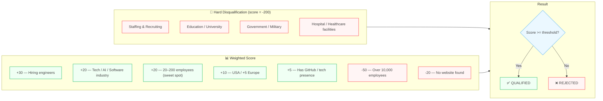

---

## 3. Prospeo Enrichment Data (Stage 3 — finder.py)

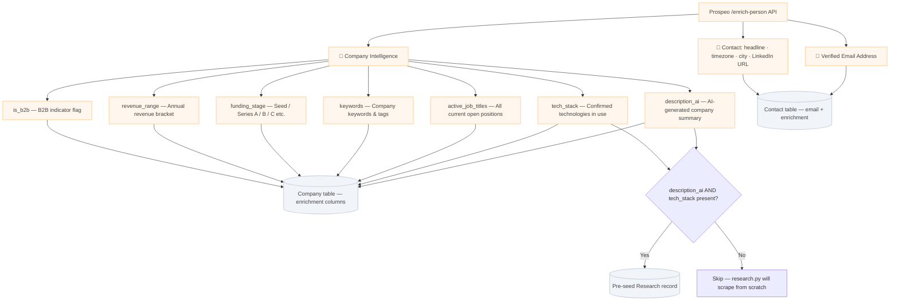

---

## 4. The 13-Step Sending Orchestrator (Stage 7)

> Every single outbound email passes through this pipeline. No exceptions.

```mermaid
flowchart TD
    classDef check fill:#ebf8ff,stroke:#90cdf4,stroke-width:2px,color:#444
    classDef block fill:#fff5f5,stroke:#fc8181,stroke-width:2px,color:#444
    classDef send fill:#f0fff4,stroke:#68d391,stroke-width:2px,color:#444
    classDef engine fill:#e6fffa,stroke:#81e6d9,stroke-width:2px,color:#444

    START["📤 sender.py loads SCHEDULED emails where send_at <= now"] --> S0
    S0{Company already REPLIED?}
    S0 -- Yes --> CANCEL["❌ Email CANCELLED — reply already received"]:::block
    S0 -- No --> S1

    S1["Step 1: Resolve recipient contact + email"]:::check
    S1 --> S1a{Contact exists & has email?}
    S1a -- No --> B1["🚫 BLOCKED: NO_RECIPIENT_EMAIL"]:::block
    S1a -- Yes --> S2

    S2["Step 2: Validate recipient address"]:::check
    S2 --> S2a{Contact verified = INVALID?}
    S2a -- Yes --> B2["🚫 BLOCKED: CONTACT_INVALID"]:::block
    S2a -- No --> S3

    S3["Step 3: Campaign active check"]:::check
    S3 --> S3a{Campaign is_active = true?}
    S3a -- No --> B3["🚫 BLOCKED: CAMPAIGN_INACTIVE"]:::block
    S3a -- Yes --> S4

    S4["Step 4: Sending time check"]:::check
    S4 --> S4a["(Business hours logic — extensible)"]:::check
    S4a --> S5

    S5["Step 5: Full compliance check"]:::check
    S5 --> S5a["Check 4-layer suppression hierarchy"]:::check
    S5a --> S5b["Check unsubscribe token exists"]:::check
    S5b --> S5c["Check body length >= 10 chars"]:::check
    S5c --> S5d{Compliance approved?}
    S5d -- No --> B5["🚫 BLOCKED: SUPPRESSED / NO_TOKEN / EMPTY_BODY"]:::block
    S5d -- Yes --> S6

    S6["Step 6: Select eligible mailbox (rotation)"]:::engine
    S6 --> S6a["Round-robin by least-recently-sent timestamp"]:::engine
    S6a --> S6b["Skip: PAUSED / DISABLED / WARMUP_PENDING mailboxes"]:::engine
    S6b --> S6c["Skip: blocked domains (BLOCKED_SENDING_DOMAINS)"]:::engine
    S6c --> S6d["Skip: BLOCKED or DEGRADED domain health"]:::engine
    S6d --> S6e{Eligible mailbox found?}
    S6e -- No --> B6["⏸️ NO_ELIGIBLE_MAILBOX — retry later"]:::block
    S6e -- Yes --> S7

    S7["Step 7: Daily cap check"]:::check
    S7 --> S7a["sent_today vs. effective_daily_limit"]:::check
    S7a --> S7b{Under daily cap?}
    S7b -- No --> B7["⏸️ DAILY_CAP_REACHED"]:::block
    S7b -- Yes --> S8

    S8["Step 8: Hourly cap check"]:::check
    S8 --> S8a["sent_this_hour vs. daily_limit ÷ 8"]:::check
    S8a --> S8b{Under hourly cap?}
    S8b -- No --> B8["⏸️ HOURLY_CAP_REACHED"]:::block
    S8b -- Yes --> S9

    S9["Step 9: Domain aggregate limit"]:::check
    S9 --> S9a["check_domain_circuit_breakers()"]:::check
    S9a --> S9b{Domain OK?}
    S9b -- No --> B9["🚫 DOMAIN_CIRCUIT_BREAKER"]:::block
    S9b -- Yes --> S10

    S10["Step 10: Mailbox bounce circuit breaker"]:::check
    S10 --> S10a["hard_bounce_rate > 5%? bounce_rate > 10%?"]:::check
    S10a --> S11

    S11["Step 11: Mailbox spam circuit breaker"]:::check
    S11 --> S11a["spam_rate >= 0.3%? spam_rate >= 0.1%?"]:::check
    S11a --> S11b{All breakers clear?}
    S11b -- No --> B11["🚫 MAILBOX_CIRCUIT_BREAKER → auto-PAUSE"]:::block
    S11b -- Yes --> S12

    S12["Step 12: Build & send message"]:::send
    S12 --> S12a["Inject List-Unsubscribe header (RFC 8058)"]:::send
    S12a --> S12b["Inject List-Unsubscribe-Post: One-Click"]:::send
    S12b --> S12c["Append unsubscribe footer (plain + HTML)"]:::send
    S12c --> S12d["Thread follow-ups via In-Reply-To + References"]:::send
    S12d --> S12e{"Provider: Google OAuth → Gmail API or SMTP"}:::send
    S12e --> S12f{Send success?}
    S12f -- No --> FAIL["❌ FAILED — process_bounce if applicable"]:::block
    S12f -- Yes --> S13

    S13["Step 13: Record event + update counters"]:::engine
    S13 --> S13a["MessageEvent: type=SENT"]:::engine
    S13a --> S13b["SendingStats: increment hourly/daily counters"]:::engine
    S13b --> S13c["Mailbox: total_sent++, last_sent_at = now"]:::engine
    S13c --> S13d["Company: status = EMAIL_SENT"]:::engine
    S13d --> S13e["Auto-activate warmup if first send"]:::engine
    S13e --> DONE["✅ Email SENT — Message-ID stored"]:::send
```

---

## 5. Mailbox Warmup State Machine

> Mailboxes progress through a 7-state lifecycle. Transitions are automatic based on metrics.

```mermaid
stateDiagram-v2
    [*] --> WARMUP_PENDING: New mailbox added

    WARMUP_PENDING --> WARMUP_ACTIVE: Manual activation\nor first send

    WARMUP_ACTIVE --> ESTABLISHED: days >= 7\nAND sent >= 30\nAND bounce < 3%

    ESTABLISHED --> HEALTHY: days >= 21\nAND sent >= 150\nAND bounce < 2%\nAND spam < 0.1%

    ESTABLISHED --> DEGRADED: bounce > 5%\nOR spam >= 0.1%

    HEALTHY --> DEGRADED: bounce > 5%\nOR spam >= 0.1%

    DEGRADED --> PAUSED: bounce >= 10%\nOR spam >= 0.3%

    PAUSED --> RECOVERY: Manual admin resume

    RECOVERY --> ESTABLISHED: 7 days with\nbounce < 3%\nAND spam < 0.1%

    note right of WARMUP_PENDING: Cap: 0 emails/day\n(no sending)
    note right of WARMUP_ACTIVE: Cap: 5 emails/day\n(start slow)
    note right of ESTABLISHED: Cap: 20 emails/day\n(building reputation)
    note right of HEALTHY: Cap: 40 emails/day\n(full capacity)
    note left of DEGRADED: Cap: 8 emails/day\n(reduced volume)
    note left of PAUSED: Cap: 0 emails/day\n(all sending stopped)
    note left of RECOVERY: Cap: 8 emails/day\n(slow restart)
```

### Base Daily Caps by State

| State | Base Cap | Purpose |
|-------|----------|---------|
| `WARMUP_PENDING` | **0** | No sending — awaiting activation |
| `WARMUP_ACTIVE` | **5** | First week — prove deliverability |
| `ESTABLISHED` | **20** | Building consistent reputation |
| `HEALTHY` | **40** | Full capacity (further adjusted by metrics) |
| `DEGRADED` | **8** | Under investigation — reduced load |
| `PAUSED` | **0** | Circuit breaker fired — all sending halted |
| `RECOVERY` | **8** | Slow restart after admin resume |

---

## 6. Dynamic Daily Cap Calculation

> The base cap is NOT the final limit. It's multiplied by 4 dynamic factors.

```mermaid
flowchart LR
    classDef calc fill:#ebf8ff,stroke:#90cdf4,stroke-width:2px,color:#444
    classDef mult fill:#fefce8,stroke:#fde68a,stroke-width:2px,color:#444
    classDef result fill:#f0fff4,stroke:#68d391,stroke-width:2px,color:#444

    BASE["Base Cap\n(from warmup state)"]:::calc

    BASE --> M1
    subgraph M1["× Reputation Multiplier"]
        direction TB
        R1["Score ≥ 80 → ×1.3"]:::mult
        R2["Score ≥ 60 → ×1.0"]:::mult
        R3["Score ≥ 40 → ×0.7"]:::mult
        R4["Score ≥ 20 → ×0.4"]:::mult
        R5["Score < 20 → ×0.1"]:::mult
    end

    M1 --> M2
    subgraph M2["× Bounce Rate Penalty"]
        direction TB
        B1["Bounce ≥ 10% → ×0.0 (STOP)"]:::mult
        B2["Bounce ≥ 3% → ×0.3"]:::mult
        B3["Bounce ≥ 2% → ×0.7"]:::mult
        B4["Bounce < 2% → ×1.0"]:::mult
    end

    M2 --> M3
    subgraph M3["× Spam Rate Penalty (Google thresholds)"]
        direction TB
        S1["Spam ≥ 0.3% → ×0.0 (STOP)"]:::mult
        S2["Spam ≥ 0.1% → ×0.5"]:::mult
        S3["Spam < 0.1% → ×1.0"]:::mult
    end

    M3 --> M4
    subgraph M4["× Age Bonus"]
        direction TB
        A1["≥ 30 days → ×1.2"]:::mult
        A2["≥ 14 days → ×1.0"]:::mult
        A3["≥ 7 days → ×0.8"]:::mult
        A4["< 7 days → ×0.6"]:::mult
    end

    M4 --> FINAL["Effective Daily Limit\n= base × rep × bounce × spam × age"]:::result
    FINAL --> HOURLY["Hourly Limit = daily ÷ 8\n(min 1 per hour)"]:::result
```

### Example Calculation

A **HEALTHY** mailbox (base=40), reputation 85, bounce 0.5%, spam 0.02%, 45 days active:

```
40 × 1.3 × 1.0 × 1.0 × 1.2 = 62 emails/day
Hourly cap = 62 ÷ 8 = 7 emails/hour
```

A **WARMUP_ACTIVE** mailbox (base=5), reputation 50, bounce 0%, spam 0%, 3 days active:

```
5 × 1.0 × 1.0 × 1.0 × 0.6 = 3 emails/day
Hourly cap = max(1, 3 ÷ 8) = 1 email/hour
```

---

## 7. Circuit Breaker System

> Circuit breakers fire automatically. When triggered, they can reduce volume, pause a mailbox, or shut down an entire domain.

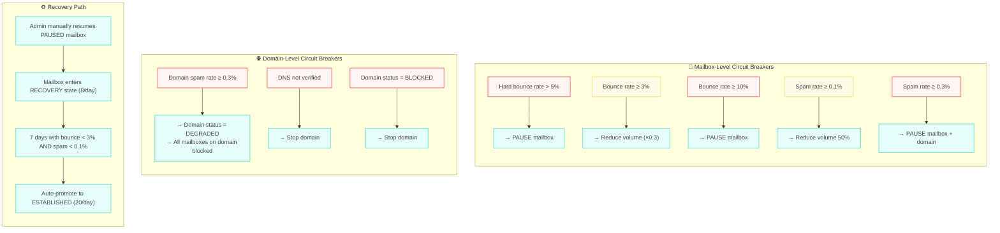

### Threshold Reference Table

| Metric | Warning | Critical | Action |
|--------|---------|----------|--------|
| Hard bounce rate | — | **> 5%** | Pause mailbox |
| Bounce rate | **≥ 3%** (×0.3 volume) | **≥ 10%** | Pause mailbox |
| Spam rate | **≥ 0.1%** (×0.5 volume) | **≥ 0.3%** | Pause mailbox + degrade domain |
| Domain spam rate | — | **≥ 0.3%** | Degrade domain (all mailboxes blocked) |

> **Why 0.3%?** Google's Postmaster Tools flags domains at 0.3% spam rate as "critical". Above this threshold, deliverability drops catastrophically and the domain risks permanent blacklisting.

---

## 8. 4-Layer Suppression Hierarchy (compliance.py)

> Checked in order. First match = BLOCKED. No email leaves the system if any layer triggers.

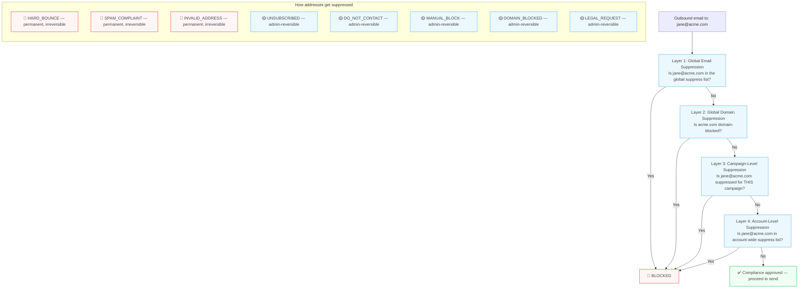

### Permanent vs. Reversible Suppression

| Category | Reasons | Can be reversed? |
|----------|---------|-----------------|
| **Permanent** | `HARD_BOUNCE`, `SPAM_COMPLAINT`, `INVALID_ADDRESS` | ❌ Never — hard-coded protection |
| **Admin-reversible** | `UNSUBSCRIBED`, `DO_NOT_CONTACT`, `MANUAL_BLOCK`, `DOMAIN_BLOCKED`, `LEGAL_REQUEST` | ✅ Admin can unsuppress |

---

## 9. Unsubscribe Flow (RFC 8058 Compliant)

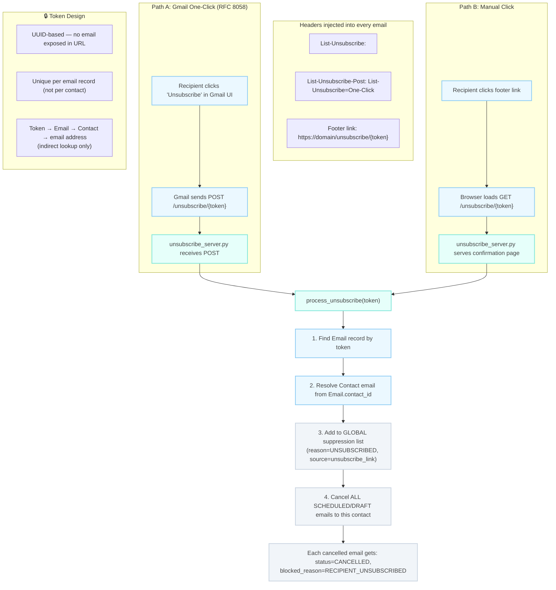

---

## 10. Bounce & Complaint Processing

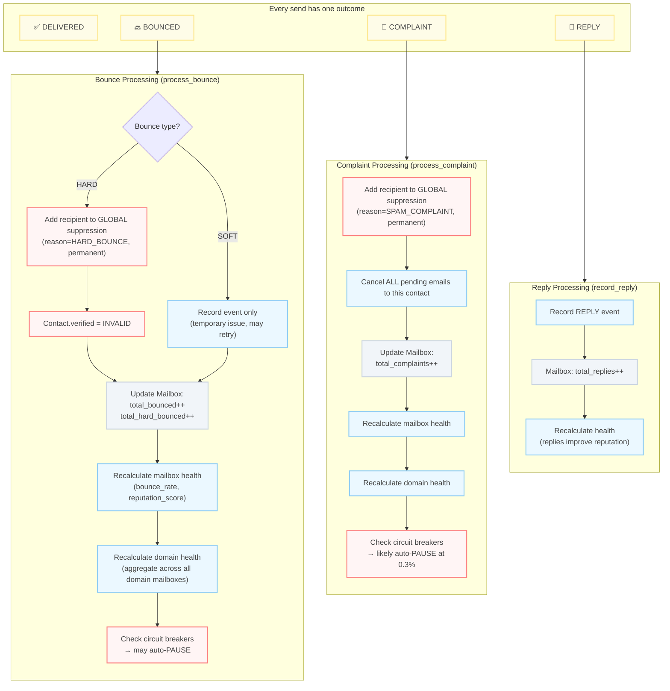

---

## 11. Reputation Score Formula

> Our internal operational score (0–100). Higher = healthier mailbox.

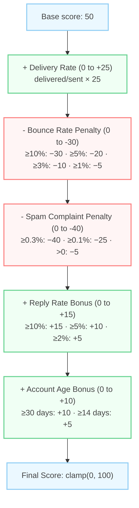

### Score Range Interpretation

| Score | Meaning | Effect on Daily Cap |
|-------|---------|-------------------|
| **80–100** | Excellent — strong deliverability | ×1.3 multiplier |
| **60–79** | Good — normal operations | ×1.0 multiplier |
| **40–59** | Fair — needs monitoring | ×0.7 multiplier |
| **20–39** | Poor — significant issues | ×0.4 multiplier |
| **0–19** | Critical — near total block | ×0.1 multiplier |

---

## 12. Domain Health Aggregation

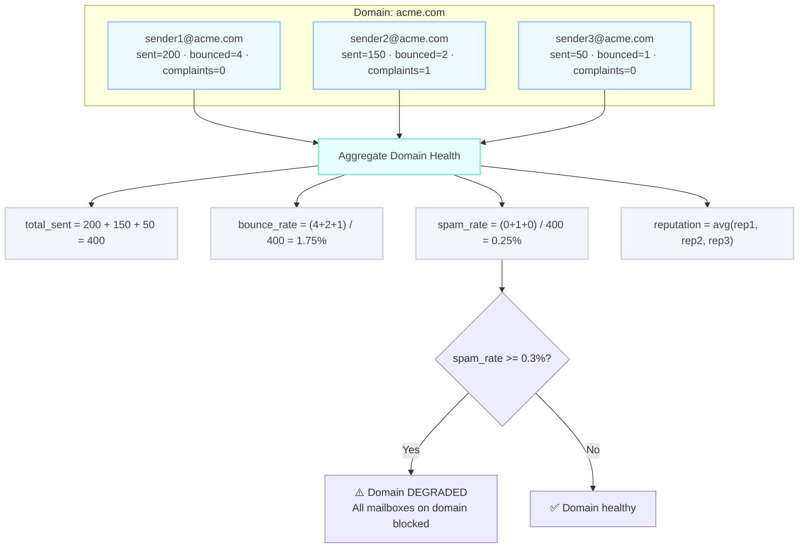

---

## 13. Provider Adapter Architecture

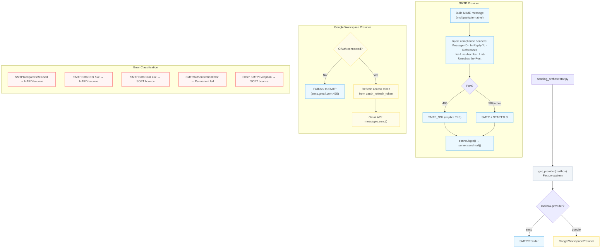

---

## 14. Mailbox Rotation Algorithm

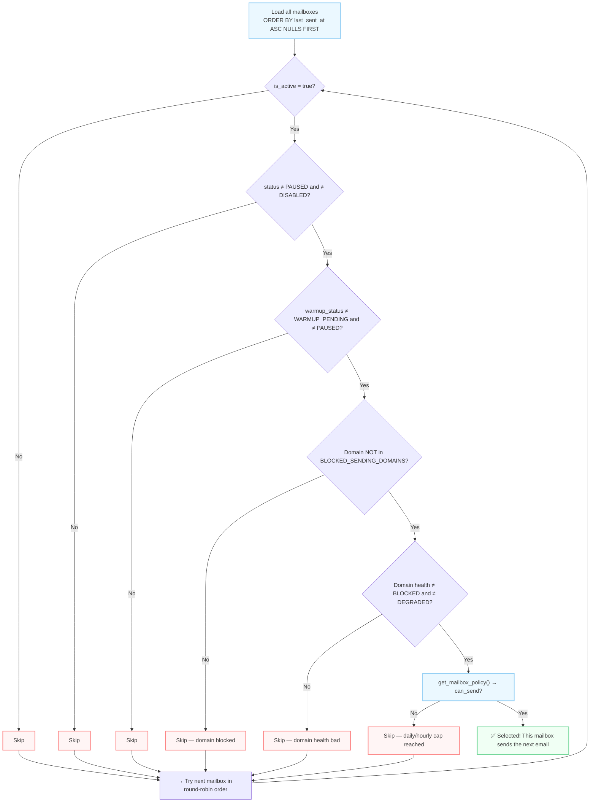

> **Round-robin strategy:** Mailboxes are sorted by `last_sent_at ASC NULLS FIRST` — the mailbox that hasn't sent in the longest time goes first. This naturally distributes volume evenly across all healthy mailboxes without complex weighting algorithms.

---

## 15. Scheduler (Production Automation)

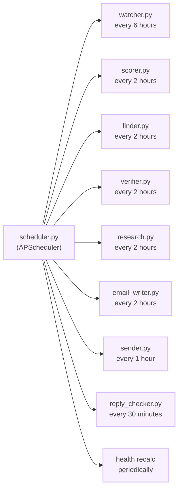

> Each stage runs as an isolated subprocess — one crash doesn't take down the pipeline.
